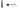

---
<p align="center">


</p>

the-libs is a set of common classes used in the* apps.

---

# Build
Depending on your platform, run the following commands in your terminal:

## macOS and Linux
```
qmake
make
```

## Windows
```bash
qmake
nmake
```
You can subsitute jom for nmake if you have it.

# Install

## macOS and Linux
On Linux, run the following command as root:
```
make install
```

## Windows
Run the following command from an elevated command prompt:
```
nmake install
```

---

> © Victor Tran, 2021. This project is licensed under the GNU General Public License, version 3, or at your option, any later version.
> 
> Check the [LICENSE](LICENSE) file for more information.